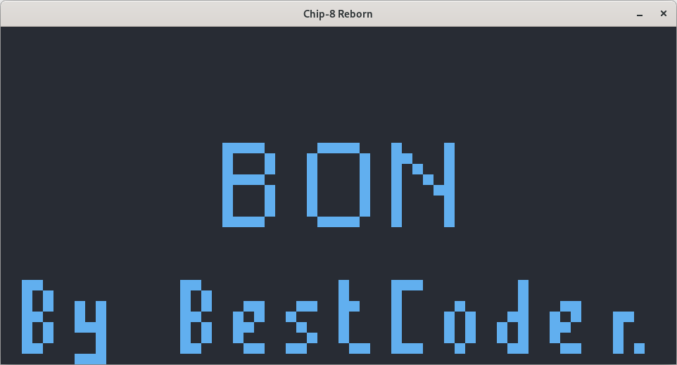
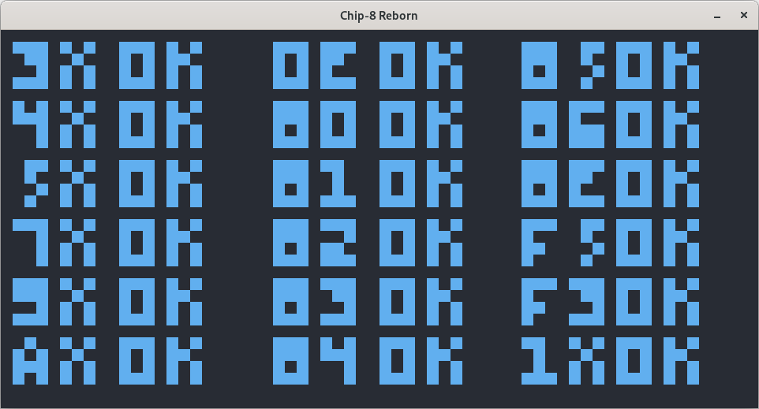
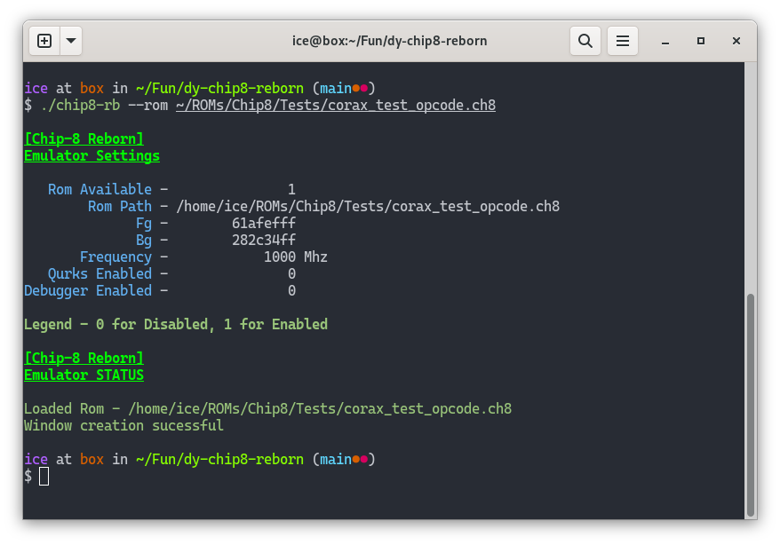

# What is dy-chip8-reborn

dy-chip8-reborn is the second iteration of my chip8 emulator in C. The previous/first version was a rush job and I was inexperienced and the
code base ended up being a mess with macros and what not god forbidden things littered all over the place.

This is my attempt to completely rewrite another chip8 emulator from scratch and newer goals in mind:

- A feature-rich debugger
- Accurate timers
- Clean and Readable Code
- Portable across Operating Systems

and anything else that I may wish to do in the future.

## Usage

Currently the emulator is in the beta. Emulator passes all test ROMs borrowed from the Emudev Discord server.

You can obtain the games from [this link](https://johnearnest.github.io/chip8Archive/)

```sh
$ chip8-rb  --help
```

## Goals

- [x] Support all chip8 instructions

- [x] Be able to play games

- [x] Emulator  configurability

- [ ] Fully featured UI

## Showcase

- [Best Coder's Test ROM](https://cdn.discordapp.com/attachments/465586212804100106/482263586547302426/BC_test.ch8)


- [Corax's Test ROM](https://github.com/corax89/chip8-test-rom)


- Terminal Logging Output


## Dependencies

- [sdl2](https://libsdl.org/) - Graphics, Audio and Timers Library 
- [make](https://www.gnu.org/software/make/) - Build system
- cc   - A C Compiler
  
## Compiling

Make sure that `sdl2`, `git`, `make` are installed on your machine.

For compiling a static library, check `/usr/lib` if `libSDL2.a` is present in the directory.
Otherwise compile from source or check distribution specific package if available.

Ex: Arch Linux has a package on AUR - [sdl2-static](https://aur.archlinux.org/packages/sdl2-static)

Install them using your distribution's package manager or compile from source from official website.

1. Get a copy of the code - using `git clone` or Download Zip from GitHub.
```sh
$ git clone https://github.com/icebarf/dy-chip8-reborn

$ cd dy-chip8-reborn

$ chmod +x build && ./build
```

After following above three steps, you should have a file called `chip8-rb` in the project root.

## Special Thanks

Thank you to my friends who helped my test this emulator,
suggest implementations and ideas and contribute to the project.

- [@git-bruh](https://github.com/git-bruh)
- [@Kerdek](https://github.com/Kerdek)
- [@its_pacchu](https://github.com/itspacchu)
- [@Shaw Summa](https://github.com/ShawSumma/)
