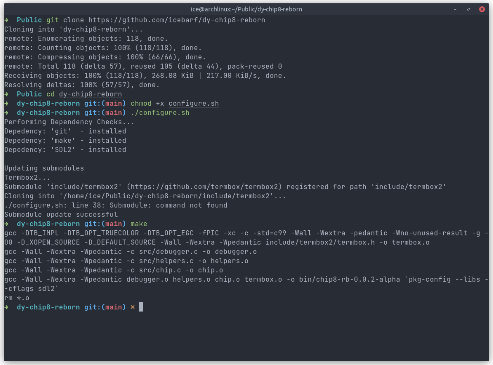

# What is dy-chip8-reborn

dy-chip8-reborn is the second iteration of my chip8 emulator in C. The previous/first version was a rush job and I was inexperienced and the
code base ended up being a mess with macros and what not god forbidden things littered all over the place.

This is my attempt to completely rewrite another chip8 emulator from scratch and newer goals in mind:

- Multi-threading
- Accurate timers
- Clean and Readable Code
- Portable across Operating Systems

and anything else that I may wish to do in the future.

# Usage

*To be functional yet*

# Dependencies

- [sdl2](https://libsdl.org/) - Graphics Rendering and Threading Library
- [git](https://git-scm.com) - For termbox as a submodule
- [make](https://www.gnu.org/software/make/) - Build system for the project
- cc - A C Compiler usually GCC or Clang
  
No need to install the following as it is shipped with code

- [termbox2](https://github.com/termbox/termbox2) - Terminal rendering library

# Compiling

Make sure that `sdl2`, `git`, `make` are installed on your machine.

Install them using your distribution's package manager or compile from source from official website.

1. Get a copy of the code - using `git clone` or Download Zip from GitHub.
2. `cd` to the directory of code.
3. `make`

After following above three steps, you should have a file called `chip8-rb`.

## Example

The following pictures shows how the code was compiled, assuming that all dependencies were installed.
